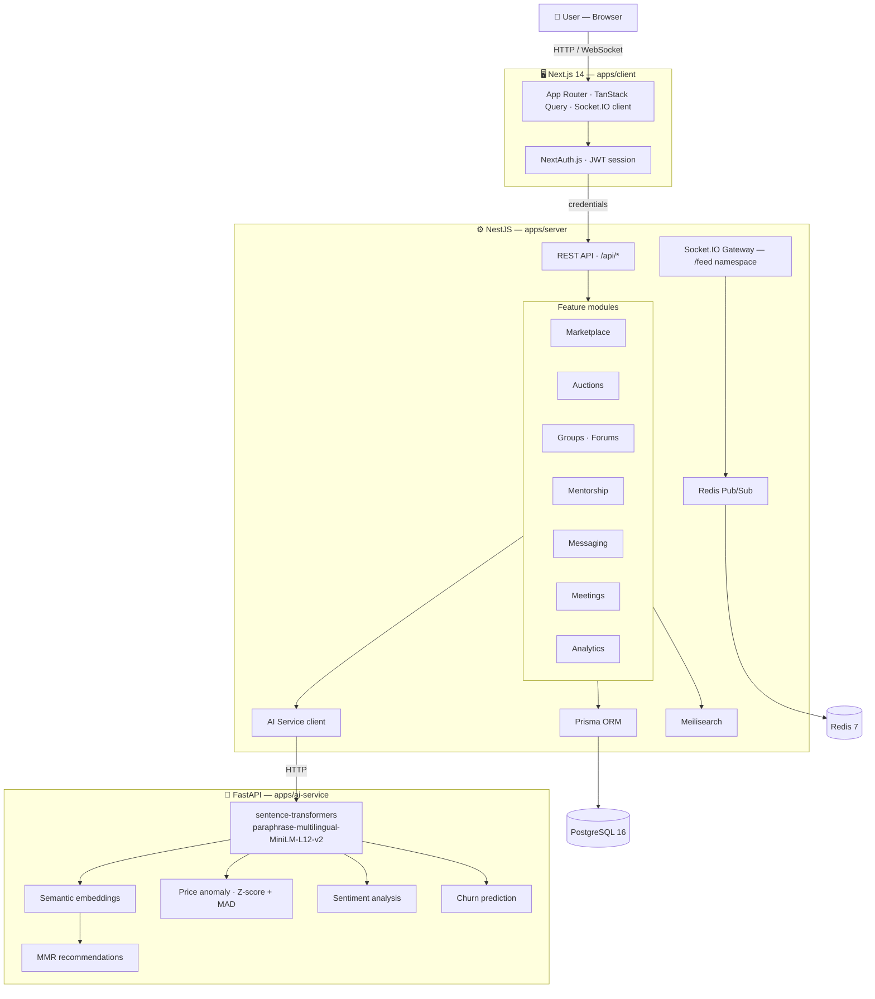

# The Communium

> A full-stack professional networking platform for Morocco — powered by AI.
> Marketplace. Auctions. Mentorship. Real-time groups. Everything in one place.

[](https://opensource.org/licenses/MIT)
[](https://nestjs.com)
[](https://nextjs.org)
[](https://www.sbert.net)
[](https://turbo.build)

---

## What it does

**B2B · B2C community platform for Moroccan entrepreneurs and professionals.**

> 🛒 A marketplace with AI-powered recommendations, price anomaly detection, and semantic similarity search.
> Real-time auctions with live bidding. Mentorship matching with semantic scoring. WebRTC group meetings.
> Fraud detection, churn prediction, sentiment analysis — all running in the background.

---

## Architecture overview

```
apps/
├── client/          Next.js 14 — App Router · Tailwind · shadcn/ui · TanStack Query
├── server/          NestJS — REST API · Socket.IO · Redis Pub/Sub · Prisma ORM
└── ai-service/      FastAPI — sentence-transformers · embeddings · anomaly detection

packages/
└── database/        Prisma schema · migrations · seed
```

---

## Start the full stack

**Prerequisites:** Node 20+, pnpm, Docker

```bash
git clone https://github.com/your-org/the-communium.git
cd the-communium
pnpm install
```

Start infrastructure (PostgreSQL · Redis · Meilisearch · AI service):

```bash
docker-compose up -d
```

Push the database schema and generate the Prisma client:

```bash
pnpm db:push
pnpm db:generate
```

Run everything in parallel:

```bash
pnpm dev
```

| Service | URL |
|---|---|
| **Frontend** | http://localhost:3000 |
| **API** | http://localhost:4000/api |
| **AI microservice** | http://localhost:8000 |
| **Meilisearch** | http://localhost:7700 |
| **Prisma Studio** | `pnpm db:studio` |

---

## How it works



---

## The stack

| Layer | Technology | Role |
|---|---|---|
| 🖥️ | **Next.js 14** | App Router · SSR · layouts · API routes |
| 🎨 | **Tailwind CSS + shadcn/ui** | Design system · dark/light themes |
| 🔄 | **TanStack Query** | Server state · optimistic updates · cache |
| ⚙️ | **NestJS** | Modular REST API · guards · decorators |
| 🔐 | **NextAuth.js** | Session management · JWT · credentials |
| 🗄️ | **Prisma + PostgreSQL** | ORM · type-safe queries · migrations |
| 🔴 | **Redis** | Cache · Pub/Sub for real-time events |
| 🔍 | **Meilisearch** | Full-text search · filters · facets |
| 🤖 | **FastAPI + sentence-transformers** | Multilingual semantic embeddings |
| 📡 | **Socket.IO** | Real-time feed · likes · comments |
| ☁️ | **Cloudflare R2** | File storage (images · uploads) |
| 💳 | **Stripe + CMI** | International + Moroccan payments |
| 📧 | **Resend** | Transactional email |

---

## AI features

The AI microservice runs independently. NestJS calls it over HTTP. It never touches the database directly.

| Feature | How |
|---|---|
| **Semantic recommendations** | Listing embeddings → cosine similarity → MMR diversity reranking |
| **Mentor matching** | User profile + expertise embeddings → semantic + rating + experience scoring |
| **Price anomaly detection** | Z-score + MAD per category → flags over/under-priced listings |
| **Sentiment analysis** | Review text → positive / negative / neutral classification |
| **Churn prediction** | Activity signals → risk score → retention triggers |
| **Auto-tagging** | Listing description → suggested tags via zero-shot classification |
| **Similar listings** | Vector similarity search at `/listings/:id/similar` |
| **Delivery ETA** | Category + city → statistical delivery time estimate |

Model: `paraphrase-multilingual-MiniLM-L12-v2` — supports French, Arabic, and English out of the box.

---

## Platform features

```
Community          Commerce              Tools
──────────────     ──────────────────    ────────────────
Groups             Marketplace           AI Search
Forums             Auctions (live bid)   Price Alerts
Events             Comparisons           Bookmarks
Connections        Payments (Stripe/CMI) Admin dashboard
Mentorship         Tokens (TKS)          Analytics
WebRTC Meetings    Membership plans      Notifications
Activity Feed      File uploads (R2)     Badges
Polls              Company creation      FAQ · Contact
```

---

## Real-time architecture

Groups use **Redis Pub/Sub → Socket.IO** for live updates. No polling.

```
Client joins room          socket.join('group:<id>')
User likes a post          → GroupsService.toggleLike()
                           → Redis.publish('group:likes', payload)
FeedGateway (subscriber)   → server.to('group:<id>').emit('postLiked', payload)
All clients in room        ← receive event instantly
```

Same pattern for new comments (`group:comments` channel).

---

## Database commands

```bash
pnpm db:push        # Apply schema changes to DB (dev, no migration file)
pnpm db:migrate     # Create a named migration (staging / prod)
pnpm db:generate    # Regenerate Prisma client after schema change
pnpm db:seed        # Seed demo data
pnpm db:studio      # Open Prisma Studio GUI at localhost:5555
```

---

## LAN sharing (test on another device)

Edit `apps/client/.env`:
```env
NEXTAUTH_URL=http://192.168.1.X:3000
NEXT_PUBLIC_API_URL=http://192.168.1.X:4000/api
NEXT_PUBLIC_WS_URL=http://192.168.1.X:4000
```

Edit the root `.env`:
```env
FRONTEND_URL=http://192.168.1.X:3000
```

The client dev server already binds to `0.0.0.0` — no extra flag needed.

---

## Environment variables

| Variable | Required | Description |
|---|---|---|
| `DATABASE_URL` | ✅ | PostgreSQL connection string |
| `REDIS_URL` | ✅ | Redis connection string |
| `JWT_SECRET` | ✅ | **Change this before any deployment** |
| `MEILISEARCH_API_KEY` | ✅ | Meilisearch master key |
| `S3_ENDPOINT` / `S3_ACCESS_KEY` | ✅ | Cloudflare R2 credentials |
| `STRIPE_SECRET_KEY` | optional | Stripe payments |
| `CMI_MERCHANT_ID` | optional | Moroccan CMI payments |
| `RESEND_API_KEY` | optional | Transactional email |

---

## Project structure

```
apps/
  client/src/
    app/           App Router pages — (auth) · (dashboard) · onboarding
    components/    ui/ · layout/ · marketplace/ · groups/ · forums/ · profile/
    hooks/         TanStack Query hooks by feature
    lib/           API client · auth client · i18n · utils
    types/         Centralized TypeScript types

  server/src/
    marketplace/   Listings · images · favorites · AI insights
    auctions/      Bid engine · countdown · winner resolution
    groups/        Posts · comments · likes · FeedGateway (Socket.IO + Redis)
    forums/        Topics · replies · likes
    mentorship/    Profiles · matching · sessions · reviews
    meetings/      WebRTC rooms · participants
    ai/            AI service HTTP client
    analytics/     Dashboard stats · activity tracking · daily snapshots
    redis/         Global @Global() cache + Pub/Sub module
    auth/          JWT guard · onboarding · registration

packages/
  database/
    prisma/schema.prisma    Full schema — 50+ models
```

---

## What this is not

- Not a SaaS product for resale — it's an engineering project built for real business use.
- Not a generic starter template — every feature is wired to the Moroccan B2B/B2C context.
- Not dependent on external AI APIs at runtime — the AI microservice runs locally via Docker.
- Not a toy demo — real payments (Stripe + CMI), real file storage (R2), real WebRTC meetings.

---

## PFE context

> **Title:** Conception d'une Plateforme Communautaire Intelligente basée sur l'IA : Recommandation Sémantique, Détection d'Anomalies et Analyse Prédictive du Comportement Utilisateur

| | |
|---|---|
| **Filière** | Génie Data Science & Intelligence Artificielle |
| **Entreprise d'accueil** | Hamri Capital |
| **Périmètre** | 3 apps · 50+ modèles DB · 30+ modules API · 1 microservice IA |
| **Contributions IA** | Embeddings sémantiques · MMR · détection d'anomalies · churn · sentiment |

---

[📖 API Docs](http://localhost:4000/api/docs) · [🐳 Docker Compose](docker-compose.yml) · [🗄️ Prisma Schema](packages/database/prisma/schema.prisma)

Built by TALEB7 · MIT License
